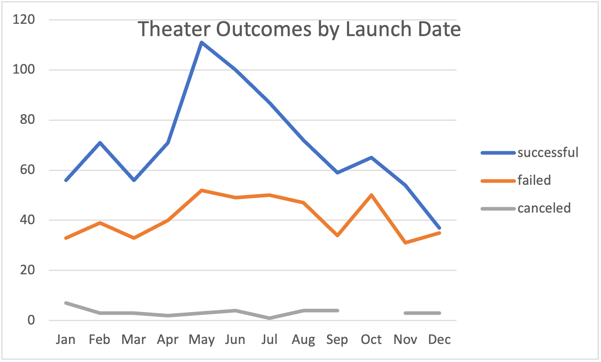
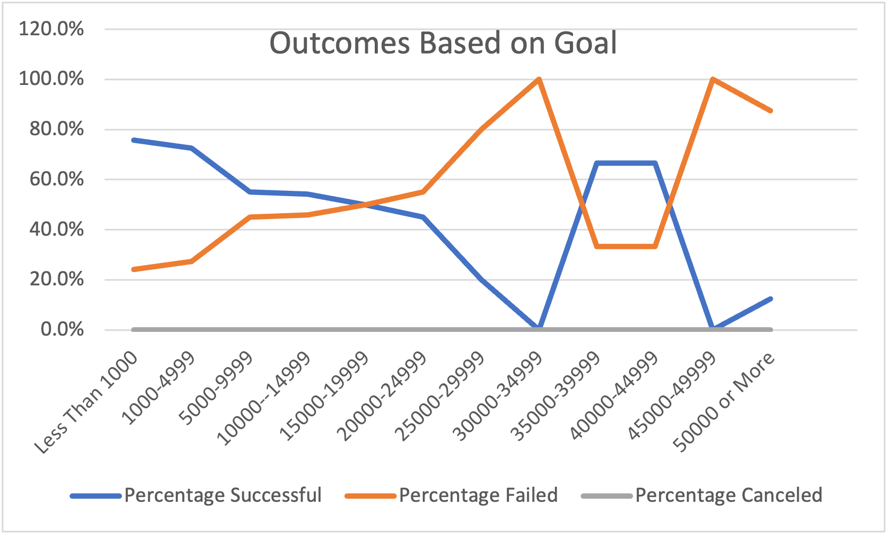

# Kickstarting with Excel

## Overview of Project

### Purpose
Louise's Kickstarter campaign in support of her play, Fever, is performing well in a short period of time.  Louise has requested an analysis on other plays that were part of a Kickstarter campaign to determine:
-    a) A possible correlation between campaign launch date and its subsequent success/failure;
-    b) The success/failure rate, in relation to the goal set in the campaign.
## Analysis and Challenges

### Analysis of Outcomes Based on Launch Date
Our first task was to look at the outcomes of Kickstarter campaigns based on the month they were launched. Using a PivotTable, we were able to sort through the data to highlight only the number of successful, failed, and canceled, broken down by month.  From here, a line chart was created to visualize the data.

### Analysis of Outcomes Based on Goals
Our second task was to analyse the outcomes of campaigns, categorized by their fund-raising goal. We are trying to determine if there is a relationship between the size of the goal and whether it was successful or not. Using IFCOUNTS formula, we were able to easily pull the relevant data out of the larger population. We created another line chart to visualize the data:

### Challenges and Difficulties Encountered
Working with large data sets without having a complete understanding of what you are looking for and what the result will be makes it easier to overlook a formuation error.  
## Results

- What are two conclusions you can draw about the Outcomes based on Launch Date?
 Two conclusions I have drawn from the Outcomes based on Launch Date:
-   i)The largest number of launches occur in May/June
-   ii)While more campaigns were "successful" during this time, the "failed" and "canceled" outcomes did not increase or decrease to the same degree.

- What can you conclude about the Outcomes based on Goals?
 I conclude that the success rate of a campaign is partially related to the goal.  As the goal amount increased, success rate decreased, with the exception of 9 projects in the $35k-$45k range.  More analysis is needed on that data to determine other extenuating circumstances that affected the outcome of those projects.
 
- What are some limitations of this dataset?
This data tells us how the projects performed without any weight given to the quality of the projects.  A project that captures the imagination in the blurb is more likely to meet it's goal, however this information is not easily quantifiable.  A point rating on the project based on the blurb would be helpful as an additional metric in determining its potential success.

- What are some other possible tables and/or graphs that we could create?
Additional tables we could create are:
-    a)Outcome based on Country.  Are contributors more likely to back projects based on country of origin? Are they more likely to avoid projects on the same basis? To visualize this data, I would use a stacked bar graph, with countries on the X-Axis and total outcomes on the y.
-    b)Outcome vs Length of Time Campaign is Active.  There is an assumption that the longer a campaign is active, the greater visibility it has and therefore the more likely it is to be successful.  A line chart with length of days active on the x-axis and number of outcomes on the y axis would help us visualize if there is a strong or slight correlation.
